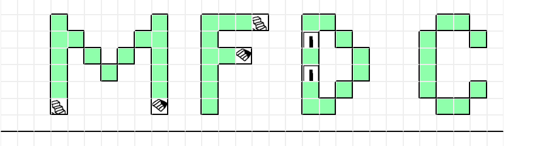

# MapForDungeonCrawler

When you were playing dugeon crawler games (eg. Wizardry, The Portopia Serial Murder Case),
graph paper and pencil were your best friends. Today, this program takes their place.

MapForDungeonCrawler (MFDC) is a Javascript project which helps you make 2d maps for dungeons.

## Features
MFDC is inspired by Etrian Odyssey series, which features map making system.
So, if you are familiar to EO, you can expect what to come from MFDC.

## Planned Features
I'm going to add these features in the future:
* Save/Load Map option
* Export Map data for game creators

## How to Use
Put the all contents of this repository on whereever directory you like,
and access to 'index.html' with your browser.

## Who to Use
* If you are playing Wizardry: Proving Grounds of the Mad Overlord, MFDC is for you.

## Demo
Not available yet!
